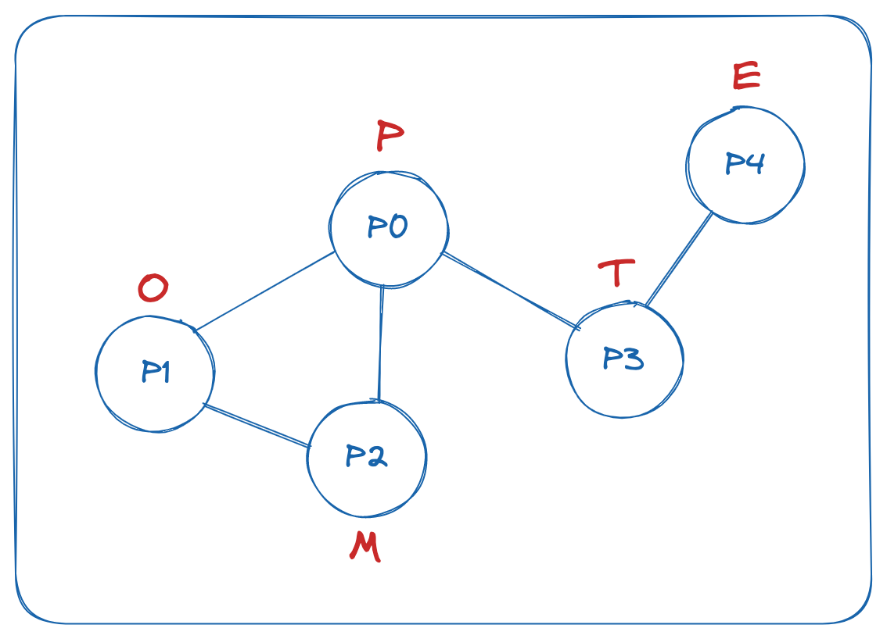
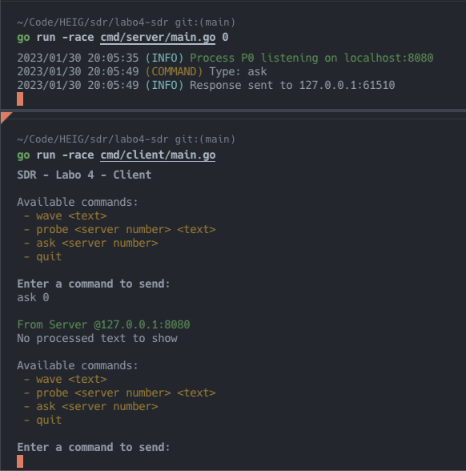
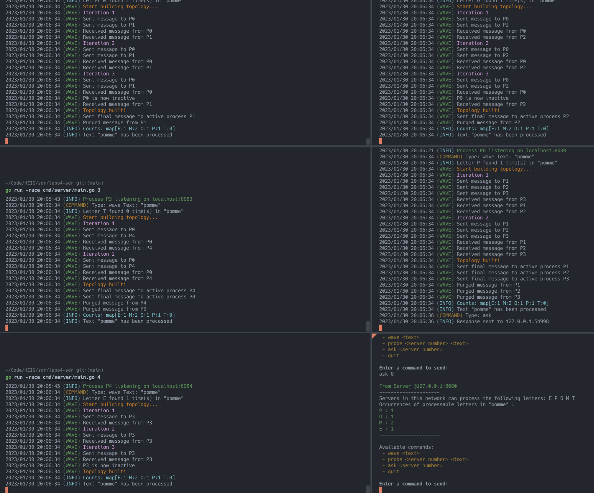
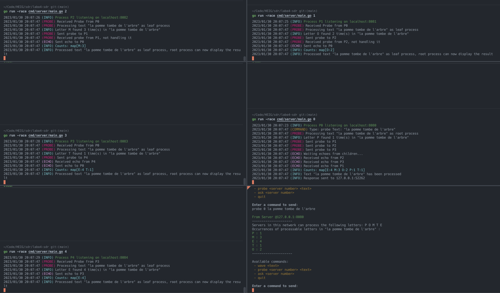
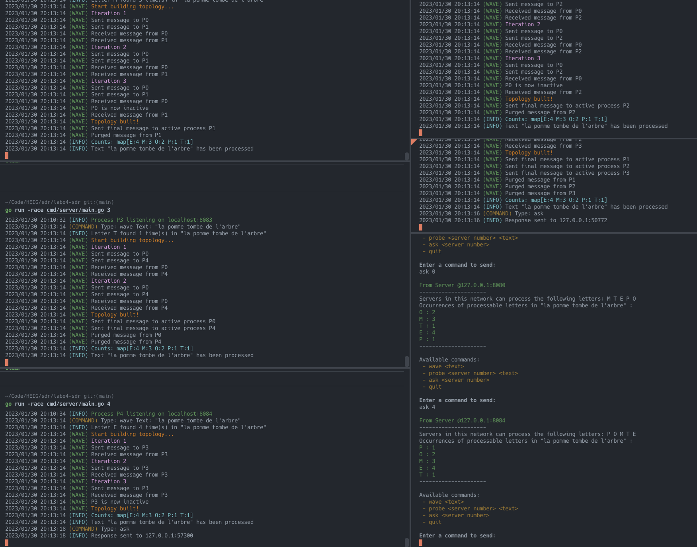
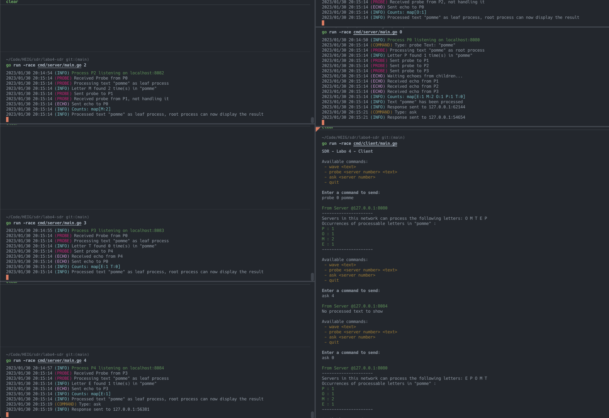
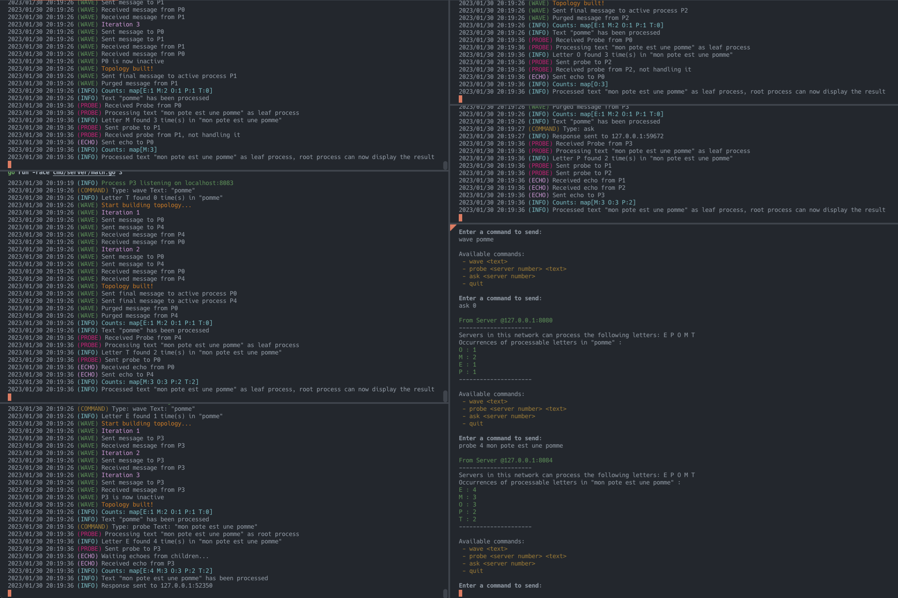

# Laboratoire 4 de SDR - Comptage du nombre d'occurrences de lettres dans un texte dans un système distribué

## Auteurs

Lazar Pavicevic et Jonathan Friedli

## Contexte

Ce projet est réalisé dans le cadre du cours de Systèmes Distribués et Répartis (SDR) de la HEIG-VD.

Dans ce laboratoire, nous implémentons deux algorithmes: l'algorithme ondulatoire et l'algorithme sondes et échos afin de compter de façon distribuée le nombre d’occurrences de lettres dans un texte grâce à un réseau de serveurs. Le réseau est agencé comme un graphe. Toutes les connexions sont réalisées en UDP.

## Utilisation du programme

L'application contient deux exécutables : un pour le serveur et un pour le client.

### Pour lancer un serveur:

Le serveur a besoin d'un entier en argument qui représente le numéro de processus lié à un serveur. Ce numéro est la clé de la map des serveurs du réseau que nous retrouvons dans son fichier de configuration. La map contient l'adresse des autres serveurs du réseau et la lettre qu'ils traitent.

```bash
# A la racine du projet

# Lancement du serveur n°1 en mode race
go run -race cmd/server/main.go 1
```

### Pour lancer un client:

Le client n'a pas besoins d'argument pour être lancé.

```bash
# A la racine du projet

# Lancement d'un client en mode race
go run -race cmd/client/main.go
```

### Commandes disponibles:

```bash

# Commande demandant le traitement d'un texte avec l'algorithme ondulatoire
wave <text>

# Commande demandant le traitement d'un texte avec l'algorithme sondes et échos en spécifiant le serveur racine
probe <server number> <text>

# Commande demandant le résultat du dernier traitement effectué
# Ondulatoire: Tout les serveurs peuvent répondre
# Sondes et échos: Seul le serveur racine peut répondre
ask <server number>

# Commande permettant de quitter le client
quit
```

# Les tests

Il n'était pas demandé d'effectuer des tests unitaires et automatisés pour ce laboratoire. Il n'était pas non plus demandé de simuler des ralentissements ou des paquets perdus. Nous avons donc effectué des tests manuels pour vérifier le bon fonctionnement de notre application sans utiliser de mode `debug` simulant ces dégradations.

Tous nos tests sont effectués avec la configuration fournie dans les fichiers de `config.json` de chaque exécutable. Dans le fichier `config.json` du serveur, nous avons ajouté une liste d'adjacence pour identifier les serveurs voisins de chaque serveur.

Le graphe logique de notre réseau est le suivant:



Nous avons ajouté un cycle simple entre P0-P1-P2 pour tester la détection de cycle. En rouge, nous retrouvons l'unique lettre qui sera traitée par le serveur.

## Procédure de tests manuels

### Test n°1

On commence par faire la commande `ask` sur le serveur P0

**Input du client:**

```bash
ask 0
```

**Résultat attendu:**  
Le server P0 nous répond qu'il n'y a pas encore eu de texte traité.



### Test n°2

On fait la commande `wave` avec le texte "pomme" puis on fait la commande `ask` sur le serveur P0.

**Input du client:**

```bash
wave pomme
ask 0
```

**Résultat attendu:**  
Le server P0 nous montre le nombre d'occurrences de chaque lettre dans le mot "pomme".



### Test n°3

On fait la commande `probe` avec le texte "la pomme tombe de l'arbre" sur le serveur P0.

**Input du client:**

```bash
probe 0 la pomme tombe de l'arbre
```

**Résultat attendu:**  
Le server P0 nous montre le nombre d'occurrences de chaque lettre dans le texte "probe 0 la pomme tombe de l'arbre".



### Test n°4

On fait une commande `wave` puis on vérifie si la réponse est similaire sur 2 serveurs différents.

**Input du client:**

```bash
wave tombe
ask 0
ask 4
```

**Résultat attendu:**  
On remarque que l'ordre des lettres n'est pas pareil mais le compte de chaque lettre est équivalent.



### Test n°5

On fait une commande `probe` puis on vérifie la réponse d'un serveur "feuille" et d'un serveur "racine".

**Input du client:**

```bash
probe 0 pomme
ask 4
ask 0
```

**Résultat attendu:**  
Le serveur P0 nous donne le bon compte de lettres mais le serveur P4 nous dit qu'aucun texte n'a été traité car ce dernier est un processus feuille dans cette itération.



### Test n°6

On fait une commande `wave` puis une commande `probe` à la suite pour vérifier que les serveurs peuvent traiter plusieurs commandes à la suite avec un état correct.

**Input du client:**

```bash
wave pomme
ask 0
probe 4 mon pote est une pomme
```

**Résultat attendu:**  
Le résultat des deux commandes est correct.



## Implémentation

### Le client

Le client effectue une nouvelle connexion UDP à un serveur à chaque commande envoyée.

Le client parse l'input en ligne de commande et crée un objet `Command` si l'input est valide. Il transforme ensuite cet objet en string JSON et l'envoie au serveur.
Il lui est possible de passer des textes entiers séparés par des espaces. Il a cependant une taille de buffer limitée à 1024 octets, ce qui empêche d'envoyer des textes trop longs.

Quitter un client avec CTRL+C ou en envoyant la commande `quit` ferme la connexion UDP en cours et arrête le client gracieusement.

### Le serveur

Le serveur ne laisse qu'un traitement en cours à la fois. La commande `wave` n'engendre pas de réponse de la part du serveur, ce qui fait qu'une attente dûe à un traitement en cours n'est pas forcément perceptible par l'utilisateur. Pour la commande `probe`, le client va devoir attendre la réponse retardée du serveur.

Au niveau de la commande `ask`, nous avons rajouté la possibilité de l'utiliser sur le serveur racine d'un traitement avec une commande `probe` (en plus de la réponse attendue). Par contre, les serveurs feuilles enverront toujours une réponse négative.

Finalement, il est possible d'effectuer le traitement d'un texte tenant dans un buffer de 1024 octets avec autant d'espace que l'on souhaite entre les mots.
